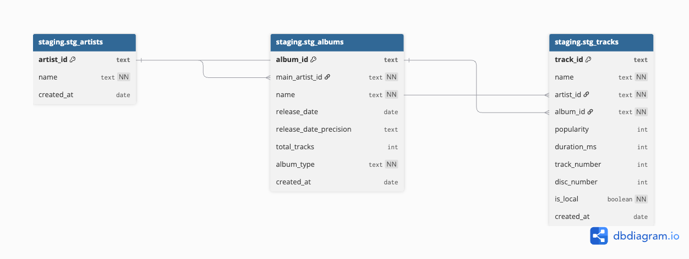
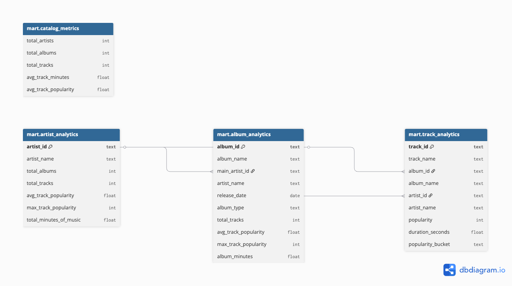
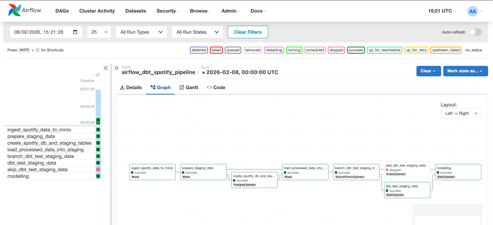
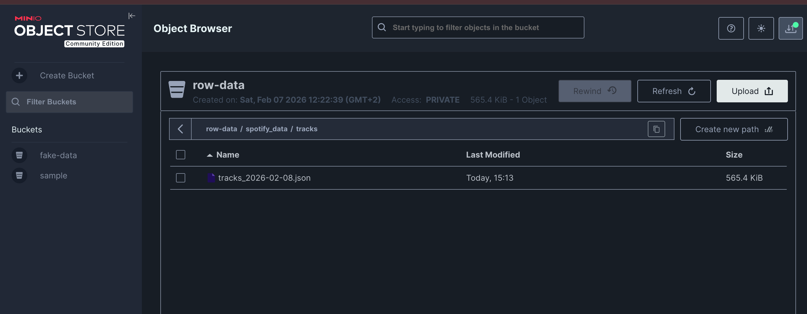
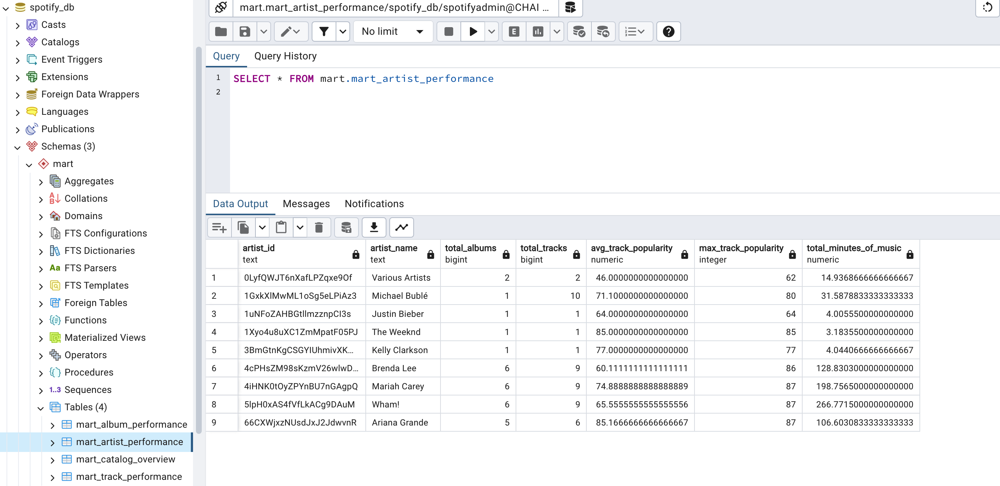

# Spotify Data Pipeline with Airflow, MinIO, Postgres & dbt

## 1. Project Introduction

This project implements an end-to-end **data engineering pipeline** that ingests data from the **Spotify API**, stores raw data in **MinIO**, validates and transforms the data, loads it into a **Postgres staging environment**, and finally applies **dbt** to build analytical data models.  
The entire workflow is fully containerized using **Docker** and orchestrated end-to-end with **Apache Airflow**.

---

## 2. Workflow Overview (High Level)

The pipeline follows these main steps:

1. **Ingestion**
   - Raw JSON data is extracted from the Spotify API.
   - The raw data is stored in MinIO (S3-compatible object storage).

2. **Validation & Transformation**
   - Raw data is validated to ensure it matches the expected schema and format.
   - Valid records are transformed and prepared for downstream processing.

3. **Staging Load**
   - Transformed data is loaded into a **Postgres staging schema**.

4. **Analytics with dbt**
   - dbt test are applied on top of the staging tables.
   - Analytical (reporting) models are generated for downstream use.

All services (Airflow, MinIO, Postgres, dbt) run inside Docker containers and are orchestrated by Airflow from ingestion to analytics.

---

## 3. How to Run the Pipeline End-to-End

### Prerequisites

- Docker & Docker Compose installed
- Spotify Developer account
- Spotify API access credentials (Client ID & Client Secret)

---

### Step 1: Configure Spotify API Access

1. Create an application at https://developer.spotify.com/
2. Generate the required access credentials.
3. Note down:
   - Client ID
   - Client Secret

---

### Step 2: Configure Environment Variables

Create a `.env` file in the project root and configure all required sensitive variables, for example:

```env
SPOTIFY_CLIENT_ID=****
SPOTIFY_CLIENT_SECRET=****

POSTGRES_DW_USER=****
POSTGRES_DW_PASSWORD=****
POSTGRES_DW_SCHEMA=****

MINIO_ACCESS_KEY=****
MINIO_SECRET_KEY=****
```

---

### Step 3: Start All Services

Make sure the root director is CHAI-DATAENGINEER-ASSESSMENT, this can be validated by running:

```bash
pwd
```

Start all services:

```bash
docker compose up -d
```

Verify that all containers are running:

```bash
docker compose ps
```

---

### Step 4: Access the Services

- **Airflow UI**  
  http://localhost:8081  
  From the UI, you can manually trigger DAGs or wait for their scheduled execution.

- **MinIO UI**  
  http://localhost:9001  
  Use this to inspect raw and processed data stored in object storage.

- **Postgres Data Warehouse (Shell Access)**  
  ```bash
  docker exec -it postgres_dw psql -U db_user -d db_name
  ```
  This allows you to verify that staging and reporting tables are being populated.

---

## 4. Dependencies & Setup

Key technologies used in this project:

- **Apache Airflow** – Workflow orchestration
- **Docker & Docker Compose** – Containerization
- **Spotify API** – Data source
- **MinIO** – Object storage for raw data
- **PostgreSQL** – Staging & analytical database
- **Python** – Ingestion, validation, transformation and orchestration logic
- **dbt** – Data transformation and modeling


All dependencies are pre-installed within the Docker images defined in the project.

### High-level Architecture

The following diagram provides high-level overview of how the components of the project are interconnected.


---

### Staging models ERD Diagram


### Mart (Reporting ) models ERD Diagram



## 5. Data Source

The data source used in this project is the **Spotify Tracks Dataset**, retrieved directly from the Spotify API.  
It includes information about tracks, artists, albums, and related metadata.

---

## 6. Data Validation & Quality Checks

The pipeline is designed with **end-to-end data validation**:

1. **Raw Data Validation**
   - Raw Spotify JSON data is validated before transformation.
   - Ensures required fields exist and data types match expectations.

2. **Staging Validation**
   - After loading data into the Postgres staging schema, **dbt tests** are executed.
   - These tests validate constraints such as uniqueness, non-null fields, and referential integrity, values fall in acceptable range, etc.

3. **Reporting Validation**
   - dbt tests are also defined on analytical/reporting models.
   - This ensures that the final data is reliable, accurate, and ready for analysis.

---

## Sample screenshoot Demostrating project in action

Airflow worflow with dbt models


Minio interface with data uploaded


Clean data into reporting model


## Conclusion

This project demonstrates a production ready, data pipeline that follows best practices in ingestion, validation, transformation, and analytics.  
By combining Modern data engineering stacks like Airflow, MinIO, Postgres, and dbt, the pipeline delivers a scalable and reliable foundation for Spotify data analytics.